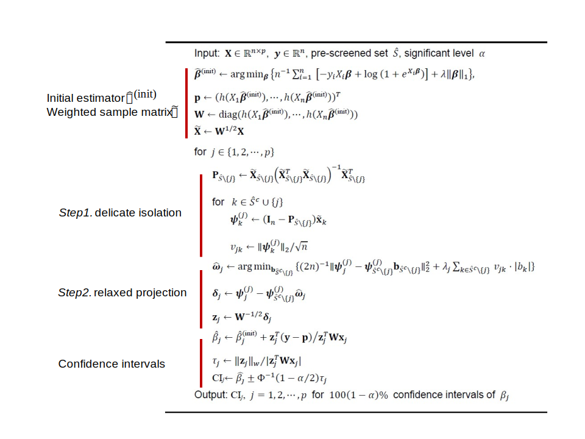

# High Dimensional Logistic Regression via Weighted Adaptive Projection

This is an R package for **Weighted Adaptive Projection (WAP)**. WAP is a feature selection algorithm that conducts parameter estimation for high dimensional logistic regression model. It first obtains the pre-screened identifiable feature set via some feature screening procedures such as distance correlation learning, SIS, etc. Based on the pre-screened set, WAP delicately distinguishes between identifiable and weak features during the estimation process through two steps: (1) delicate isolation and (2) relaxed projection. In this way, WAP can eliminate the bias induced by the estimation errors of identifiable features, and thus reduce the amount of data required for accurate parameter estimation. In summary, the proposed WAP algorithm is shown as follows:

  

